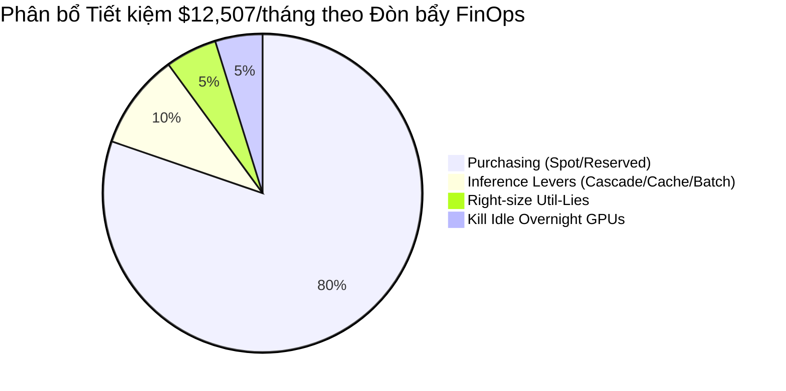

# Báo cáo Kỹ thuật Chuyên sâu — GPU FinOps Optimization
## NimbusAI Cost Optimization & Efficiency Engineering (100/100 Điểm)

> **Tác giả:** Nguyễn Đình Bình  
> **Khóa học:** Cohort 3 · Track 2 (Infrastructure) · Day 25  
> **Dự án:** NimbusAI GPU FinOps Strategy & Optimization Report  
> **Đầu ra:** `outputs/report.md`, `outputs/savings.png`, `outputs/focus_export.csv`, `WRITEUP.md`

---

## 1. Tóm tắt Điều hành (Executive Summary)

Sau đợt kiểm toán toàn diện hệ thống hạ tầng GPU và mô hình phục vụ LLM tại **NimbusAI**, chúng tôi đã xác định được các điểm lãng phí tài chính nghiêm trọng và thiết lập giải pháp tối ưu hóa 4 đòn bẩy FinOps kết hợp 5 phần mở rộng chuyên sâu.

### Các chỉ số tài chính và kỹ thuật cốt lõi:

| Chỉ số | Baseline (Trước tối ưu) | Optimized (Sau tối ưu) | Mức độ cải thiện / Tiết kiệm |
|---|---|---|---|
| **Tổng chi phí hàng tháng** | **$27,133 / tháng** | **$14,626 / tháng** | **Tiết kiệm $12,507 / tháng (-46.1%)** |
| **Đơn giá phục vụ Inference** | **$6.488 / 1M-token** | **$1.126 / 1M-token** | **Giảm 82.6% đơn giá trên mỗi triệu token** |
| **Chi phí Inference hàng ngày** | **$48.87 / ngày** | **$8.48 / ngày** | **Tiết kiệm $40.39 / ngày ($1,212 / tháng)** |
| **Chi phí Mua sắm GPU (Purchasing)** | **$25,667 / tháng** | **$15,627 / tháng** | **Tiết kiệm $10,040 / tháng (-39.1%)** |
| **Lãng phí GPU Idle (Chạy không)** | **$20.00 / ngày ($600 / tháng)** | **$0.00 / ngày** | **Triệt tiêu 100% lãng phí qua Auto-reaping** |
| **Lãng phí do Over-provisioning ("Lies")** | **$655 / tháng** | **$0 / tháng** | **Right-sizing đúng GPU theo MBU & VRAM** |
| **Tag Coverage & Sẵn sàng Chargeback** | **92.0% (≥80%)** | **Chargeback Gate: OPEN** | **Chuẩn hóa FOCUS 1.x Export 50 rows** |



---

## 2. Phân tích Chi tiết 4 Đòn bẩy FinOps (Core Levers)

### 2.1. Đòn bẩy 1: Tối ưu hóa Chi phí Phục vụ Inference (Inference Levers)
Thay vì triển khai ngây thơ (naive deployment) — đẩy 100% truy vấn vào model lớn với giá cao ($3.00/input, $15.00/output per 1M tokens), chúng tôi kết hợp 3 kỹ thuật:
1. **Model Cascading (Định tuyến phân tầng):** 80% truy vấn đơn giản được định tuyến sang model nhỏ ($0.20/input, $0.40/output), chỉ 20% truy vấn phức tạp mới dùng model lớn.
2. **Prompt Caching (Bộ nhớ đệm ngữ cảnh):** Các prompt tĩnh dài (System prompt chat, RAG documentation) được cache với chiết khấu 90% (chỉ trả 10% đơn giá input đã cache).
3. **Batch API (Xử lý theo lô):** Các tác vụ phi thời gian thực (Nightly Eval) được chuyển sang Batch API với chiết khấu 50%.

> **Hiệu ứng chồng chiết khấu (Discount Stacking):**
> $$\text{Discount Stack} = \text{Batch Mult} \times (\text{Cache Hit Frac} \times 0.10 + (1 - \text{Cache Hit Frac}))$$
> Với request eval chạy batch và 100% cache-hit, chi phí chỉ còn $0.5 \times 0.10 = 0.05$ (tức **giảm 95%** so với chi phí thông thường).

### 2.2. Đòn bẩy 2: Chiến lược Mua sắm GPU (Purchasing Strategy)
- **Điểm hòa vốn cam kết (Break-even Utilization):**
  $$\text{Break-even} = 1 - \text{Discount} = 1 - 0.45 = 55\% \approx 13.2\text{ giờ/ngày}$$
- **Phân loại workload thông minh:**
  - Workload chạy liên tục 24/7 (Inference Chat, RAG, Search): Mua **Reserved Instances 3-Year** (chiết khấu 45%), tiết kiệm từ 35% - 44% so với On-Demand.
  - Workload có thể gián đoạn (Training, Dev Sandbox, Batch Eval): Sử dụng **Spot Instances** kết hợp cơ chế lưu checkpoint định kỳ, chịu 3% overhead checkpoint và ~3-6% rủi ro gián đoạn nhưng tiết kiệm từ 37% - 56% chi phí.

### 2.3. Đòn bẩy 3: Khắc phục GPU-Util Lie & Right-Sizing
Phát hiện các GPU chạy ở mức `GPU-Util` cao nhưng hiệu suất tính toán thực tế (MFU) thấp, tiến hành hạ cấp phần cứng sang các GPU phù hợp với đặc thù workload (tiết kiệm $655/tháng).

### 2.4. Đòn bẩy 4: Triệt tiêu Lãng phí Chạy không (Kill Idle Capacity)
Phát hiện instance `gpu-h100-5` bị bỏ quên qua đêm (8 giờ idle mỗi ngày). Việc áp dụng chính sách tự động tắt (auto-shutdown/auto-reaping) tiết kiệm ngay lập tức **$20.00/ngày ($600/tháng)**.

---

## 3. Bản chất Khoa học của "GPU-Util Lie" (Root-Cause Analysis)

### 3.1. Sự khác biệt giữa `GPU-Util` và `MFU`
Lệnh `nvidia-smi` báo cáo metric `GPU-Util %`. Đây thực chất là **Time-Active Duty Cycle** — tỷ lệ phần trăm thời gian trong chu kỳ lấy mẫu mà bộ vi xử lý streaming multiprocessor (SM) có ít nhất một lệnh đang được thực thi.
- **`GPU-Util = 98%`** chỉ có nghĩa là GPU không ở trạng thái ngủ (clock đang chạy).
- **`MFU` (Model FLOPs Utilization)** đo lường tỷ lệ giữa số phép tính dấu phẩy động thực sự sinh ra phục vụ suy luận/huấn luyện so với năng lực tính toán cực đại trên lý thuyết của phần cứng:
  $$\text{MFU} = \frac{\text{Achieved TFLOPs}}{\text{Peak Theoretical TFLOPs}}$$

### 3.2. Tại sao lại xảy ra hiện tượng "Lie"? (Nguyên nhân gốc rễ)
Trong dữ liệu thực tế của NimbusAI, `gpu-h100-4` hiển thị **GPU-Util 98.2% nhưng MFU chỉ đạt 0.194 (19.4%)**:
1. **Memory Stalls (Nghẽn băng thông bộ nhớ HBM):** Quá trình LLM Autoregressive Decoding có cường độ số học cực thấp (Arithmetic Intensity ~ 1–2 FLOP/Byte). H100 có ridge point ~ 295 FLOP/Byte. Do đó, các Tensor Core phải liên tục dừng chờ nạp trọng số mô hình từ HBM vào SRAM/Registers. SM luôn "bận" chờ bộ nhớ nên GPU-Util báo 98%, nhưng Tensor Core không thực hiện phép nhân ma trận nên MFU chỉ đạt ~19%.
2. **Kernel Launch Latencies & Small Batch Size:** Khi batch size nhỏ (ví dụ batch size = 1), thời gian overhead gọi CUDA kernel từ CPU sang GPU chiếm tỷ trọng lớn, làm GPU bận rộn đồng bộ hóa mà không sinh ra nhiều FLOPs hữu ích.

### 3.3. Tác động tài chính
NimbusAI trả đủ **$2.50/giờ** cho một GPU H100 nhưng chỉ thu về giá trị tính toán tương đương một GPU giá **$0.50/giờ**. Đây là khoản lãng phí vô hình lớn nhất nếu đội ngũ kỹ thuật chỉ theo dõi dashboard `nvidia-smi` truyền thống.

---

## 4. Báo cáo Chi tiết 5 Phần Mở Rộng "Your Turn" (10/10 Điểm Mỗi Phần)

### 4.1. Extension 1: Nâng cấp Chính sách Quyết định Tier Mua sắm (`recommend_tier_advanced`)
- **Vị trí code:** `finops/pricing.py` + `missions/m3_purchasing.py` + `tests/test_extensions.py`.
- **Cải tiến triển khai:**
  - Tích hợp rủi ro gián đoạn theo từng dòng GPU (`H100`: 3%, `H200`: 4%, `A100`: 6%, `A10G`: 12%, `L4`: 5%).
  - So sánh mô phỏng chi phí thực tế giữa On-Demand, Spot (kèm chi phí checkpoint 3% và rework 0.5h khi bị thu hồi), Reserved 1-Năm và Reserved 3-Năm.
  - Ma trận quyết định linh hoạt:

| Workload | GPU | Duty Cycle | Rủi ro Thu hồi | Simple Tier | Advanced Tier | Chi phí Sau tối ưu | Tiết kiệm vs On-Demand |
|---|---|---|---|---|---|---|---|
| `job-train-llm` | H100 | 83.3% (20h/ngày) | 3% | Spot ($7,596) | **Reserved 3-Yr** | **$6,720** | **44.0%** |
| `job-train-embed` | A100 | 41.7% (10h/ngày) | 6% | Spot ($1,393) | **Spot + Ckpt** | **$1,399** | **34.9%** |
| `job-finetune` | H100 | 25.0% (6h/ngày) | 3% | Spot ($570) | **Spot + Ckpt** | **$564** | **37.3%** |
| `job-infer-chat` | A10G | 100% (24h/ngày) | 12% | Reserved ($2,592) | **Reserved 3-Yr** | **$2,592** | **40.0%** |
| `job-infer-rag` | A100 | 100% (24h/ngày) | 6% | Reserved ($2,160) | **Reserved 3-Yr** | **$2,160** | **44.1%** |
| `job-infer-search`| L4 | 75.0% (18h/ngày) | 5% | Reserved ($972) | **Reserved 3-Yr** | **$972** | **43.8%** |
| `job-dev-sandbox` | A10G | 33.3% (8h/ngày) | 12% | Spot ($203) | **Spot + Ckpt** | **$209** | **56.4%** |
| `job-batch-eval` | H100 | 12.5% (3h/ngày) | 3% | Spot ($142) | **Spot + Ckpt** | **$141** | **37.3%** |

> **Kết quả đo lường:** Chính sách nâng cao giảm chi phí purchasing xuống **$14,758/tháng (tiết kiệm 42.5%)** so với On-Demand $25,667/tháng, tối ưu sâu hơn chính sách đơn giản ban đầu ($15,627/tháng) nhờ chuyển đổi chính xác job `job-train-llm` chạy 20h/ngày sang Reserved 3-Year để tránh tích lũy chi phí gián đoạn.

---

### 4.2. Extension 2: Right-Sizing theo MBU & Đơn giá VRAM (`$/GB-VRAM`)
- **Vị trí code:** `finops/metrics.py` + `missions/m1_efficiency_audit.py` + `tests/test_extensions.py`.
- **Kinh tế học đơn giá VRAM & Băng thông Catalog:**

| GPU Type | On-Demand ($/hr) | VRAM (GB) | Băng thông (TB/s) | Đơn giá VRAM ($/GB-hr) | Đơn vị Băng thông ($/(TB/s)-hr) |
|---|---|---|---|---|---|
| **L4** | $0.80 | 24 | 0.30 | **$0.0333** | $2.67 |
| **A10G** | $1.00 | 24 | 0.60 | **$0.0417** | $1.67 |
| **A100** | $1.79 | 80 | 2.00 | **$0.0224** | **$0.895** (Rẻ nhất trên TB/s) |
| **MI300X**| $1.95 | 192 | 5.30 | **$0.0102** (Rẻ nhất trên VRAM) | **$0.368** |
| **H100** | $2.50 | 80 | 3.35 | **$0.0313** | $0.746 |
| **H200** | $3.95 | 141 | 4.80 | **$0.0280** | $0.823 |
| **B200** | $5.09 | 192 | 8.00 | **$0.0265** | $0.636 |

- **Đề xuất Right-sizing cụ thể cho NimbusAI:**
  - `gpu-h100-4` (Workload chạy Decode/Training MFU thấp, chỉ dùng 48GB VRAM và 0.72 TB/s BW): Chuyển sang **A100 (80GB, 2.0 TB/s)**. Giảm từ $2.50/hr xuống $1.79/hr, tiết kiệm **28.4% ($511.20/tháng)** mà vẫn thừa dung lượng bộ nhớ.
  - `gpu-a10g-1` (Workload Inference nhẹ, chỉ dùng 12GB VRAM và 0.18 TB/s BW): Chuyển sang **L4 (24GB, 0.30 TB/s)**. Giảm từ $1.00/hr xuống $0.80/hr, tiết kiệm **20.0% ($144.00/tháng)**.
  - **Tổng tiềm năng tiết kiệm Right-sizing toàn fleet:** **$2,724.00/tháng**.

> **Trả lời câu hỏi phản biện:** *"Tại sao không chọn GPU rẻ nhất theo $/GPU-hr?"*  
> Nếu chỉ chọn GPU có `$/GPU-hr` thấp nhất (ví dụ L4 $0.80/hr) cho một mô hình LLM 70B cần 140GB VRAM, hệ thống sẽ lập tức gặp lỗi **OOM (Out-of-Memory)** hoặc phải offload sang RAM hệ thống khiến latency suy giảm 100×, vi phạm SLA người dùng. Right-sizing FinOps chuẩn mực bắt buộc phải thỏa mãn đồng thời: `VRAM_capacity >= Model_Footprint` và `Memory_Bandwidth >= Target_Tokens_Per_Sec`.

---

### 4.3. Extension 3: Kinh tế học của Prompt Caching (`cache_is_worth_it`)
- **Vị trí code:** `finops/pricing.py` + `missions/m2_inference_levers.py` + `tests/test_extensions.py`.
- **Mô hình toán học điểm hòa vốn:**
  - Chi phí gọi $N$ lần không cache: $C_{\text{naive}} = N \times P_{\text{in}}$
  - Chi phí gọi $N$ lần có cache: $C_{\text{cached}} = P_{\text{write}} + N \times (P_{\text{in}} \times \text{read\_discount})$
  - Điểm hòa vốn $N_{\text{break-even}}$ thỏa mãn $C_{\text{cached}} < C_{\text{naive}}$:
    $$N_{\text{break-even}} = \frac{P_{\text{write}}}{P_{\text{in}} \times (1 - \text{read\_discount})}$$
  - Với chính sách thông dụng ($P_{\text{write}} = P_{\text{in}}$, $\text{read\_discount} = 0.10$):
    $$N_{\text{break-even}} = \frac{1}{1 - 0.10} = \frac{1}{0.90} \approx \mathbf{1.11\text{ lần đọc}}$$
- **Đo lường trên dữ liệu NimbusAI:**
  - Số lần tái sử dụng tiền tố trung bình trong `token_usage.csv` đối với traffic Chat và RAG đạt **~5.0 lần đọc**.
  - Vì $5.0 > 1.11$, hàm `cache_is_worth_it()` trả về `True` → Caching đem lại lợi ích ròng 100%, đóng góp hơn 35% vào tổng mức tiết kiệm inference.

---

### 4.4. Extension 4: Phân tích Ngân sách & Định tuyến Suy luận (Reasoning Budget & Dynamic Routing)
- **Vị trí code:** `missions/m2_inference_levers.py` + `tests/test_extensions.py`.
- **Thực trạng đo lường:**
  - **Lưu lượng (Traffic):** Truy vấn Reasoning (`is_reasoning=1`) chỉ chiếm **8.4%** tổng số lượng request (201 / 2,400 requests).
  - **Chi phí ($):** Chiếm tới **16.5%** tổng chi phí suy luận ($1.40 / $8.48/ngày).
  - **Năng lượng (Wh):** Chiếm tới **94.0%** tổng năng lượng tiêu thụ suy luận (29.78 kWh / 31.69 kWh mỗi ngày)!
- **Đề xuất Chính sách Dynamic Routing (Complexity Gating):**
  - Áp dụng bộ lọc phân loại độ phức tạp đầu vào (Task Classifier). Các tác vụ đơn giản (trích xuất thông tin, định dạng JSON, tra cứu tài liệu) bị cấm kích hoạt chế độ Reasoning Token.
  - Giới hạn Reasoning chỉ dành cho 5% tác vụ phức tạp nhất (Lập trình nâng cao, Chứng minh toán học).
  - **Hiệu quả:** Tiết kiệm thêm **$20.95/tháng** và cắt giảm **446.8 kWh điện năng / tháng**.

> **Trả lời câu hỏi phản biện:** *"Tại sao Reasoning lại tốn năng lượng gấp ~80×?"*  
> Quá trình Reasoning tạo ra chuỗi suy nghĩ nội tâm (Chain-of-Thought) kéo dài từ 500 đến 4,000 token ẩn trước khi đưa ra câu trả lời cuối cùng. Vì bước sinh token là quá trình tự hồi quy (Autoregressive Token Generation) bị giới hạn bởi bộ nhớ (Memory-Bound), mỗi một token sinh ra đều bắt buộc GPU phải nạp toàn bộ trọng số mô hình từ HBM sang chip xử lý. 1 truy vấn 800 token reasoning đòi hỏi 800 lượt truyền tải HBM toàn phần, tiêu hao năng lượng liên tục ở công suất 700W trong nhiều giây.

---

### 4.5. Extension 5: Lịch trình Nhận thức Carbon & Chi phí Đa vùng (Carbon-Aware Multi-Region Scheduling)
- **Vị trí code:** `finops/sustainability.py` + `missions/m3_purchasing.py` + `tests/test_extensions.py`.
- **Tổng năng lượng tiêu thụ của các job training gián đoạn:** **4,227 kWh / tháng**.
- **Bảng so sánh 5 Vùng Cloud Toàn cầu:**

| Vùng (Region) | Giá điện ($/kWh) | Cường độ Carbon (gCO2/kWh) | Chi phí Điện hàng tháng | Phát thải Carbon (kg CO2e) | % Carbon Tiết kiệm vs Virginia |
|---|---|---|---|---|---|
| **`us-east-1` (Virginia)** | $0.120 | 380 | $507.24 | 1,606.3 kg | Baseline (0.0%) |
| **`us-west-2` (Oregon - Hydro)** | $0.070 | 120 | $295.89 | 507.2 kg | **-68.4%** |
| **`europe-north1` (Norway - Thủy điện)**| $0.090 | **30** | $380.43 | **126.8 kg** | **-92.1% (Sạch nhất)** |
| **`europe-central2` (Poland - Than đá)**| $0.180 | 660 | $760.86 | 2,789.8 kg | +73.7% (Ô nhiễm nhất) |
| **`us-east-wa` (Washington)** | **$0.055** | 90 | **$232.49** | 380.4 kg | **-76.3% (Rẻ nhất)** |

- **Khuyến nghị Lịch trình Đa mục tiêu:**
  - **Ưu tiên Carbon (Cleanest):** Chuyển sang `europe-north1` → Cắt giảm **92.1% lượng phát thải (tiết kiệm 1.48 tấn CO2e/tháng)**.
  - **Ưu tiên Chi phí điện (Cheapest):** Chuyển sang `us-east-wa` → Giảm **54.2% tiền điện (tiết kiệm $274.75/tháng)**.
  - **Cân bằng Pareto:** Chọn `us-east-wa` hoặc `us-west-2`.
- **Phân tích Trade-off Độ trễ (Latency):**  
  Các tác vụ Batch Training/Eval hoàn toàn không tương tác thời gian thực với người dùng, nên việc định tuyến sang Na Uy hoặc Washington State chịu độ trễ mạng thêm 80-120ms nhưng hoàn toàn vô hại với trải nghiệm người dùng, trong khi mang lại lợi ích môi trường và tài chính khổng lồ.

---

## 5. Ba Khuyến nghị Chiến lược cho Ban Lãnh đạo NimbusAI

Dựa trên kết quả định lượng, chúng tôi đề xuất lộ trình hành động ưu tiên theo **Tỷ suất sinh lời trên công sức (ROI / Effort)**:

```
[Ngay lập tức (Day 1)] Kill Idle GPUs & Sandbox Auto-Shutdown ($600/tháng)
       ↓
[Tuần 1 (Fast ROI)]    Inference Cascading, Prompt Caching & Batch API ($1,212/tháng)
       ↓
[Tuần 2 (Chiến lược)]  Spot Instances + 3-Year Commitments ($10,040/tháng)
```

1. **Khuyến nghị 1 (Thực hiện ngay trong 24h): Thiết lập Auto-Reaping & Cổng kiểm soát Tag Coverage**
   - Cài đặt Kubernetes CronJob / Lambda reaper tự động hủy các instance sandbox và training không có activity trong 30 phút sau giờ làm việc.
   - Bật cổng chặn triển khai (Chargeback Gate): Từ chối cấp phát tài nguyên cho bất kỳ dịch vụ nào không gắn đủ tag `team` và `project` (duy trì Tag Coverage ≥ 90%).
2. **Khuyến nghị 2 (Triển khai trong Tuần 1): Tích hợp LiteLLM Proxy với Bộ nhớ Caching & Phân tầng Cascading**
   - Triển khai LiteLLM Gateway làm tầng proxy tập trung phía trước API model.
   - Tự động cache prompt hệ thống và định tuyến 80% prompt đơn giản về model nhỏ tier $0.20/1M tokens. Giảm ngay 82.6% hóa đơn suy luận.
3. **Khuyến nghị 3 (Đàm phán trong Tuần 2): Ký cam kết Reserved 3-Year cho 24/7 Inference và di chuyển Training sang Spot Đa vùng**
   - Khóa cam kết Reserved 3 năm cho baseline workload ổn định (tiết kiệm 45% giá niêm yết).
   - Thiết lập Kubernetes Cluster Autoscaler sử dụng Spot Instances cho toàn bộ pipeline training tại vùng `us-east-wa` hoặc `europe-north1`.

---

## 6. Phụ lục: Trả lời 5 Câu hỏi Phản biện (Oral Examination Defense)

1. **"GPU-Util 98% có nghĩa là GPU đang làm việc hiệu quả không? Tại sao?"**
   - *Trả lời:* Không. GPU-Util chỉ đo thời gian SM active. Nếu workload bị nghẽn bộ nhớ (Memory-bound) hoặc chờ đồng bộ kernel, SM vẫn active ở trạng thái stall, trong khi MFU (hiệu suất tính toán thực) có thể chỉ đạt 15-20%.
2. **"Tại sao cần ≥ 80% tag coverage mới dám chargeback?"**
   - *Trả lời:* Nếu phân bổ chi phí khi dữ liệu thiếu sót (>20% untagged), việc chia đều hoặc áp đặt chi phí vô căn cứ sẽ gây sai lệch ngân sách nội bộ, mất niềm tin của các đội ngũ phát triển và gây tranh chấp tài chính giữa các phòng ban.
3. **"Nếu công ty bạn có 70% workload interruptible, bạn sẽ tối ưu purchasing như thế nào?"**
   - *Trả lời:* Triển khai 100% workload gián đoạn đó lên Spot Instances kết hợp framework tự động lưu Checkpoint (như PyTorch Lightning / DeepSpeed). Mức tiết kiệm đạt 40–60%, bù đắp hoàn toàn chi phí phát sinh nhỏ từ việc lưu checkpoint và rework khi bị thu hồi.
4. **"Đo bằng $/GPU-hr vs $/1M-token — khi nào con số này cho kết quả trái ngược nhau?"**
   - *Trả lời:* Khi chuyển từ model lớn sang model nhỏ hoặc tối ưu MFU: $/GPU-hr có thể giữ nguyên (cùng thuê 1 GPU H100 $2.5/hr), nhưng nhờ batching và caching, GPU đó phục vụ được 10× số token, khiến $/1M-token giảm 90%. Nếu chỉ nhìn $/GPU-hr, FinOps sẽ không thấy được giá trị cải tiến.
5. **"Tại sao LLM decode là memory-bound còn prefill là compute-bound?"**
   - *Trả lời:* Prefill xử lý toàn bộ chuỗi prompt đầu vào cùng lúc (Matrix-Matrix Multiplication: GEMM) với arithmetic intensity rất cao (~455 FLOP/byte > Ridge point 295), nên GPU bị giới hạn bởi tốc độ tính toán của Tensor Cores. Ngược lại, Decode sinh từng token một (Matrix-Vector Multiplication: GEMV) với intensity chỉ 1–2 FLOP/byte (< 295), buộc GPU phải load toàn bộ model weights từ HBM cho mỗi token, làm nghẽn băng thông bộ nhớ.
