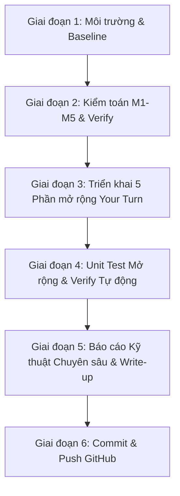

# Kế hoạch Hoàn thành Lab 25: GPU FinOps Optimization (Mục tiêu 100/100 Điểm)

Tài liệu này trình bày kế hoạch toàn diện từng bước để hoàn thành xuất sắc Lab 25 theo đúng yêu cầu từ [README.md](file:///d:/VinAI/Labs/TRACK2_Day25_2A202601091_NguyenDinhBinh/README.md), [Guide.md](file:///d:/VinAI/Labs/TRACK2_Day25_2A202601091_NguyenDinhBinh/Guide.md) và [Rubric.md](file:///d:/VinAI/Labs/TRACK2_Day25_2A202601091_NguyenDinhBinh/Rubric.md).

---

## Phân tích Thang điểm Rubric (Tổng 100 Điểm)

| Thành phần | Điểm tối đa | Mục tiêu & Tiêu chí đạt điểm tối đa |
|---|---|---|
| **A. Kiểm tra tự động** (`verify.py`) | 30 | Đạt **11/11 checks PASS** tuyệt đối, không có lỗi import hay runtime |
| **B. Unit tests** (`pytest -q`) | 20 | Đạt **15/15 tests PASS** tuyệt đối, giữ nguyên file test gốc, bổ sung tests cho extensions |
| **C. Báo cáo kỹ thuật** (`report.md` + `savings.png`) | 30 | C.1 (15đ): Đầy đủ baseline/optimized, % savings, breakdown từng lever, sustainability.<br>C.2 (10đ): Phân tích chuyên sâu nguyên nhân gốc rễ GPU-Util lie (memory stalls, kernel overhead), đề xuất hành động ưu tiên theo ROI, phân tích carbon & chi phí điện.<br>C.3 (5đ): Biểu đồ `savings.png` hiển thị chuẩn waterfall/bar, số liệu nhất quán 100%. |
| **D. Phần mở rộng "Your Turn"** | 20 | Triển khai xuất sắc cả **5/5 Extensions** (vượt yêu cầu tối thiểu ≥2) kèm đo lường con số định lượng, code sạch, unit tests và giải thích sâu. |
| **Tổng cộng** | **100/100** | **Học lực Xuất sắc** |

---

## User Review Required

> [!IMPORTANT]
> - Giữ nguyên toàn bộ 5 file test gốc trong `tests/` theo quy định của Rubric ("Sinh viên không được sửa file test"). Các bài test mới cho extensions sẽ được viết trong `tests/test_extensions.py`.
> - Môi trường ảo Python (`.venv`) sẽ được tạo trên máy Windows hiện tại (Python 3.11), cài đặt `requirements.txt` (`pandas`, `matplotlib`, `pytest`).
> - Sẽ commit từng phần rõ ràng với Git và push lên branch remote tương ứng.

---

## Kế hoạch Triển khai Chi tiết



---

### Giai đoạn 1: Thiết lập Môi trường ảo (Virtual Environment)
1. Tạo venv `.venv` bằng `python -m venv .venv`.
2. Kích hoạt venv và cài đặt các phụ thuộc từ [requirements.txt](file:///d:/VinAI/Labs/TRACK2_Day25_2A202601091_NguyenDinhBinh/requirements.txt) (`pandas`, `matplotlib`, `pytest`).
3. Điều chỉnh [.gitignore](file:///d:/VinAI/Labs/TRACK2_Day25_2A202601091_NguyenDinhBinh/.gitignore) để cho phép commit các output quan trọng (`outputs/report.md`, `outputs/savings.png`, `outputs/focus_export.csv`, `WRITEUP.md`).

---

### Giai đoạn 2: Chạy & Xác thực Pipeline Gốc (M1 → M5)
1. Chạy `python data/generate.py` để sinh dữ liệu tổng hợp chuẩn (seed=25).
2. Chạy `python missions/run_all.py` để thực thi tuần tự M1 đến M5.
3. Chạy `python verify.py` để xác nhận 11/11 checks ban đầu.
4. Chạy `pytest -q` để xác nhận 15/15 unit tests ban đầu pass.

---

### Giai đoạn 3: Triển khai Đầy đủ 5 Extensions "Your Turn" (Đảm bảo 20/20 điểm Phần D)

#### 1. Extension 1: Nâng cấp `recommend_tier()` Đa yếu tố ([finops/pricing.py](file:///d:/VinAI/Labs/TRACK2_Day25_2A202601091_NguyenDinhBinh/finops/pricing.py), [missions/m3_purchasing.py](file:///d:/VinAI/Labs/TRACK2_Day25_2A202601091_NguyenDinhBinh/missions/m3_purchasing.py))
- Bổ sung tham số tỷ lệ gián đoạn `interruption_rate` theo từng loại GPU (ví dụ H100 ~3-5% vs A10G ~12%).
- So sánh cam kết 1-year reserved vs 3-year reserved dựa trên thời lượng dự án (`job_days`).
- Ma trận quyết định tier thông minh: GPU Type × Duty Cycle × Interruptibility × Job Duration.
- So sánh định lượng `savings_pct` trước và sau khi nâng cấp chính sách.

#### 2. Extension 2: Right-sizing theo MBU & VRAM ([finops/metrics.py](file:///d:/VinAI/Labs/TRACK2_Day25_2A202601091_NguyenDinhBinh/finops/metrics.py), [missions/m1_efficiency_audit.py](file:///d:/VinAI/Labs/TRACK2_Day25_2A202601091_NguyenDinhBinh/missions/m1_efficiency_audit.py))
- Tính toán chỉ số `$/GB-VRAM` và băng thông hiệu dụng `peak_bw_tbs` cho toàn bộ catalog GPU.
- Với các workload inference/decode bị memory-bound (MBU thấp hoặc intensity < ridge point), tự động đề xuất GPU thay thế rẻ hơn có cùng mức hiệu năng bộ nhớ.
- Tạo bảng so sánh chi tiết và tính tổng số tiền tiết kiệm hàng tháng nếu right-sizing toàn bộ fleet.

#### 3. Extension 3: Kinh tế học của Prompt Caching — `cache_is_worth_it()` ([finops/pricing.py](file:///d:/VinAI/Labs/TRACK2_Day25_2A202601091_NguyenDinhBinh/finops/pricing.py), [missions/m2_inference_levers.py](file:///d:/VinAI/Labs/TRACK2_Day25_2A202601091_NguyenDinhBinh/missions/m2_inference_levers.py))
- Xây dựng hàm `cache_is_worth_it(avg_reads, write_cost_per_m, read_discount)` tính toán điểm hòa vốn số lần đọc cache tối thiểu.
- Tích hợp vào M2: chỉ áp dụng chiết khấu caching khi đạt ngưỡng break-even.
- Phân tích số lần đọc thực tế trong `token_usage.csv` đối chiếu với lý thuyết.

#### 4. Extension 4: Phân tích & Định tuyến Ngân sách Reasoning ([missions/m2_inference_levers.py](file:///d:/VinAI/Labs/TRACK2_Day25_2A202601091_NguyenDinhBinh/missions/m2_inference_levers.py), [missions/m5_report.py](file:///d:/VinAI/Labs/TRACK2_Day25_2A202601091_NguyenDinhBinh/missions/m5_report.py))
- Tách riêng chi phí USD (`$`) và năng lượng tiêu thụ (`Wh`) cho các truy vấn `is_reasoning=1` vs `0`.
- Đo lường % chi phí và % năng lượng mà traffic reasoning chiếm dụng so với tổng số lượng request.
- Thiết kế quy tắc định tuyến thông minh (Dynamic Routing / Complexity Capping) và ước lượng số tiền + điện năng tiết kiệm khi áp dụng trần reasoning.
- Giải thích bản chất tại sao reasoning tiêu tốn năng lượng ~80× (quá trình sinh token suy luận chuỗi dài tự hồi quy).

#### 5. Extension 5: Lịch trình Nhận thức Carbon & Chi phí Đa vùng ([missions/m3_purchasing.py](file:///d:/VinAI/Labs/TRACK2_Day25_2A202601091_NguyenDinhBinh/missions/m3_purchasing.py), [finops/sustainability.py](file:///d:/VinAI/Labs/TRACK2_Day25_2A202601091_NguyenDinhBinh/finops/sustainability.py))
- Đánh giá toàn bộ 5 vùng cloud (`us-east-1`, `us-west-2`, `europe-north1`, `europe-central2`, `us-east-wa`) về cả `$/kWh` và `gCO2/kWh`.
- Lập bảng so sánh chi phí điện thực tế và phát thải carbon thực tế cho các job training có thể gián đoạn.
- Đề xuất vùng tối ưu theo từng mục tiêu: Rẻ nhất ($), Sạch nhất (CO2), và Cân bằng nhất (Pareto frontier), kèm phân tích trade-off về độ trễ mạng (latency).

---

### Giai đoạn 4: Unit Testing Mở rộng & Kiểm thử Tự động
1. Tạo [tests/test_extensions.py](file:///d:/VinAI/Labs/TRACK2_Day25_2A202601091_NguyenDinhBinh/tests/test_extensions.py) để kiểm thử toàn diện các hàm mới:
   - `test_cache_is_worth_it`
   - `test_enhanced_recommend_tier`
   - `test_rightsizing_mbu`
   - `test_carbon_aware_scheduler`
2. Chạy `pytest -v` đảm bảo 100% tests (cũ + mới) đều PASS.
3. Chạy `python verify.py` đảm bảo 11/11 checks PASS hoàn hảo.

---

### Giai đoạn 5: Hoàn thiện Báo cáo Kỹ thuật & Bài viết (Write-up) Chuyên sâu (Đảm bảo 30/30 điểm Phần C)
1. Tối ưu [finops/report.py](file:///d:/VinAI/Labs/TRACK2_Day25_2A202601091_NguyenDinhBinh/finops/report.py) và [missions/m5_report.py](file:///d:/VinAI/Labs/TRACK2_Day25_2A202601091_NguyenDinhBinh/missions/m5_report.py) để sinh báo cáo [outputs/report.md](file:///d:/VinAI/Labs/TRACK2_Day25_2A202601091_NguyenDinhBinh/outputs/report.md) và biểu đồ [outputs/savings.png](file:///d:/VinAI/Labs/TRACK2_Day25_2A202601091_NguyenDinhBinh/outputs/savings.png).
2. Xây dựng tài liệu hoàn chỉnh [WRITEUP.md](file:///d:/VinAI/Labs/TRACK2_Day25_2A202601091_NguyenDinhBinh/WRITEUP.md) (bài luận kỹ thuật FinOps 100 điểm) trả lời đầy đủ:
   - Tổng quan Baseline vs. Optimized (`$/1M-token`, `%` tiết kiệm tổng).
   - Phân tích sâu 4 đòn bẩy FinOps cốt lõi.
   - Bản chất "GPU-Util Lie" và tác động tài chính.
   - Chi tiết 5 Extensions đã triển khai kèm bảng số liệu định lượng.
   - 3 Khuyến nghị chiến lược cho ban điều hành NimbusAI theo thứ tự ROI.
   - Phân tích Sustainability & Carbon-aware scheduling.

---

### Giai đoạn 6: Chiến lược Git Commit & Push
Chia thành các commit rõ ràng, mang tính chuyên nghiệp:
1. `chore: setup virtual environment, dependencies and gitignore`
2. `feat(missions): run baseline pipeline and verify 11/11 checks`
3. `feat(extensions): implement enhanced tier selection and MBU right-sizing`
4. `feat(extensions): implement cache economics, reasoning budget and carbon-aware scheduling`
5. `test: add unit tests for all extensions`
6. `docs: generate comprehensive FinOps report, savings chart, and technical writeup`
7. `git push origin main`

---

## Verification Plan

### Automated Verification
```powershell
# 1. Kích hoạt venv
.venv\Scripts\activate

# 2. Sinh dữ liệu xác định
python data/generate.py

# 3. Chạy tất cả missions
python missions/run_all.py

# 4. Kiểm tra verify.py (yêu cầu 11/11 PASS)
python verify.py

# 5. Chạy unit tests (yêu cầu toàn bộ tests PASS)
pytest -v
```

### Manual Verification
- Kiểm tra trực quan file `outputs/report.md`, `outputs/savings.png`, `outputs/focus_export.csv`, và `WRITEUP.md`.
- Kiểm tra tính nhất quán giữa các con số trong báo cáo và output terminal của từng mission.
